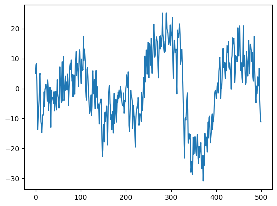
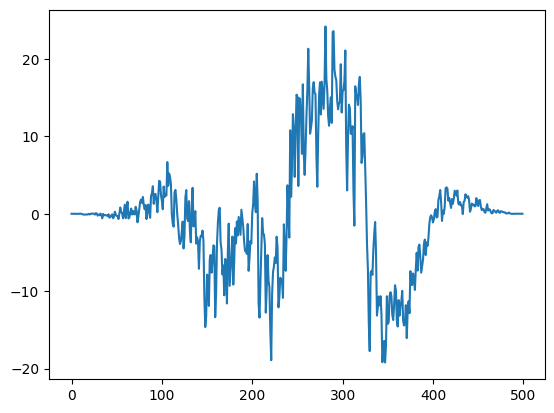

# Lofi Girl On Steroids

**General Knowledge Brain Waves**
|EEG Band|Range|Association|
|--|--|--|
|Alpha|8-13 Hz|This pattern is most pronounced when eyes are closed and during mental relaxation|
|Beta|13-30 Hz|Associated with active thinking, alertness, focus, and mental stimulation|
|Theta|4-8 Hz|Appears drowsiness and early sleep stages|

**Focus vs Immersion** 
For concentration, subjects were asked to focus on a red dot at the center of a white screen, and for immersion they were asked to focus on playing a computer game. 
How to detect focus:
| EEG Band | Change      |
|---------|-------------|
| Alpha   | Decreased   |
| Beta    | Increased   |
| Theta  | Decreased   |

How to detect immersion:
| EEG Band | Change      |
|---------|-------------|
| Alpha   | Decreased   |
| Beta    | Increased   |
| Theta  | Increased   |

## Fourier Transformation
the Fourier transform (FT) is an integral transform that takes a function as input, and outputs another function that describes the extent to which various frequencies are present in the original function.

## Hanning Window
Fourier Transformation assumes that the finite segment repeats periodically, but in reality it does not. At the start of the segment, the slope is most often not the same as at the start. Applying a window, e.g. Hanning Window, makes the amplitude at the edges 0 and therefore reduces the slope mismatch.
Example of one episode without Hanning Window:

and now with Hanning Window:

## Sources
- https://ieeexplore.ieee.org/abstract/document/8981453
- https://pmc.ncbi.nlm.nih.gov/articles/PMC6479797/#:~:text=Relative%20to%20rest%2C%20Alpha%20waves,decrease%20during%20immersion%20was%20larger.
- https://www.robots.ox.ac.uk/~sjrob/Teaching/SP/l7.pdf