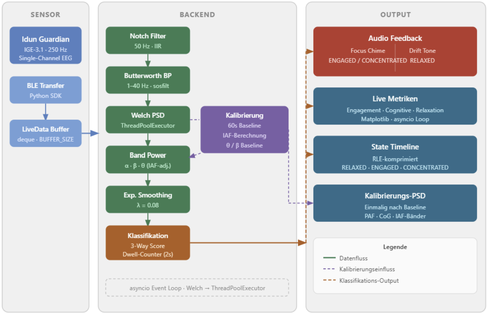

# Lofi Girl on Steroids (kinda)


## Problem Definition


Maintaining focus during learning or work is difficult, and people often do not notice immediately when their attention starts to drift. This can reduce productivity, learning efficiency and overall performance. Traditional feedback methods, such as self-reflection or productivity tracking, usually rely on manual input and only provide information after the loss of focus has already happened.


Our project addresses this challenge by exploring how EEG brain signal data can be used to detect changes in cognitive state in real time. The system analyzes EEG frequency bands and classifies the user's current state as either focused or drifting. By providing immediate feedback, the project aims to help users become more aware of their attention level and support better focus management during tasks.


The main user need is a lightweight and responsive way to recognize focus changes without requiring constant self-monitoring. This project is an experimental prototype and is not intended as a medical or diagnostic tool, but as a proof of concept for real-time neurofeedback-based focus awareness.


## Value & Impact


This project has value because it gives users immediate feedback about their cognitive state while they are working or learning. Instead of relying on self-reflection after a task is finished, the system attempts to detect focus changes in real time using EEG data. This can help users become more aware of moments when their attention decreases and support better focus management.


The potential impact is especially relevant for students, remote workers, and people who perform tasks that require long periods of concentration. A real-time focus awareness tool could help users structure breaks, improve productivity and better understand their own attention patterns over time.


From a technical perspective, the project demonstrates how brain-computer interface data can be processed and transformed into understandable user feedback. The system classifies the user state as `FOCUSED` or `DRIFTING` and provides feedback through audio cues and an overlay state file.


At the same time, the project raises important ethical considerations. EEG data is sensitive personal data, so privacy and data security must be handled carefully. The system should not be used to monitor or judge people without their consent. Additionally, the classification is experimental and should not be interpreted as a medical or diagnostic result. The main purpose of this prototype is to explore real-time neurofeedback for focus awareness in a responsible and transparent way.


## Solution Design


Our solution is designed as a real-time EEG-based focus awareness system. The system receives EEG brain signal data, processes the signal, extracts relevant frequency-band features, and classifies the user's current cognitive state. The result is then translated into simple feedback states, `FOCUSED` or `DRIFTING`.


The project supports two different data input modes. In offline mode, EEG data is replayed from a CSV file, which makes it possible to test and debug the system without a connected device. In live mode, the system connects to an IDUN Guardian EEG device and processes incoming raw EEG data in real time.


The technical pipeline starts with buffering the incoming EEG samples. The raw signal is then filtered using a notch filter to reduce power-line noise and a bandpass filter to keep the relevant EEG frequency range. After filtering, the system calculates the power spectral density using Welch's method. Based on this spectrum, the power of different EEG frequency bands such as theta, alpha, and beta is extracted.


During the first calibration phase, the system collects baseline information from the user's EEG signal. This baseline is used to make the later classification more stable and personalized. After calibration, the system calculates two main indicators: an engagement score and a relaxation score. A higher engagement score is interpreted as a more focused state, while a higher relaxation or drifting-related score can indicate that the user's attention is decreasing.


To avoid unstable or rapidly changing results, the system applies smoothing and a minimum dwell time before confirming a new state. This makes the feedback more reliable and prevents the system from switching too quickly between `FOCUSED` and `DRIFTING`.


The final state is communicated to the user in two ways. First, the system can play different audio cues when the user changes state. Second, the current state is written to a shared text file called `lofilia_state.txt`, which will be used by an external overlay script.


Overall, the solution combines signal processing, real-time classification, and user feedback into one prototype. The design focuses on feasibility and modularity, allowing the system to be tested with recorded EEG data and later extended to live neurofeedback applications.


## Architecture





## How It Works


The system works by taking EEG brain signal data, processing it in real time, and converting it into simple feedback states that describe the user's current focus level.


First, the system receives EEG data either from a recorded CSV file in offline mode or directly from an IDUN Guardian EEG device in live mode. The incoming samples are stored in a rolling buffer so that the system always has the most recent signal data available for analysis.


Next, the raw EEG signal is filtered. A notch filter is used to reduce 50 Hz power-line noise, and a bandpass filter keeps the signal within the relevant EEG frequency range. This step helps remove noise and makes the signal more suitable for feature extraction.


After filtering, the system calculates the power spectral density using Welch's method. This shows how much signal power exists at different frequencies. From this spectrum, the system extracts the power of important EEG frequency bands, especially theta, alpha, and beta.


During the first 60 seconds, the system runs a calibration phase. In this phase, it collects baseline EEG information from the user. The theta baseline is later used to make the focus classification more stable and better adapted to the individual user.


Once calibration is complete, the system calculates two main feature scores, engagement and relaxation. The engagement score is based mainly on beta activity compared to alpha and theta activity. A higher engagement score is interpreted as a more focused state. The relaxation score compares alpha activity to beta activity and can indicate a more drifting or less engaged state.


To avoid unstable results, the feature values are smoothed over time. The system also uses a minimum dwell time, which means that a new state must remain active for a short period before it is confirmed. This prevents the classification from switching too quickly between states.


Finally, the system classifies the user into one of two states: `FOCUSED` or `DRIFTING`. When the state changes, the system can provide audio feedback. It also writes the current state to a shared text file called `lofilia_state.txt`, which will be used by the external overlay script `lofilia.py`.


In summary, the system follows this pipeline:


EEG input → buffering → filtering → frequency analysis → feature extraction → calibration → classification → audio and overlay feedback


## Installation


This project uses Python and a `requirements.txt` file to install all required dependencies. The setup is slightly different depending on the operating system.


### Prerequisites

Before running the project, make sure you have the following installed:

- **Python 3.x** (with required packages from `requirements.txt`)
- **VLC Media Player** (required for audio playback — both music and TTS voice feedback)

> **Important:** VLC **must** be installed in the default installation path for audio to work properly. The application automatically looks for VLC in these locations:
>
> - **Windows (64-bit):** `C:\Program Files\VideoLAN\VLC\vlc.exe`
> - **Windows (32-bit):** `C:\Program Files (x86)\VideoLAN\VLC\vlc.exe`
>
> If VLC is installed elsewhere, audio playback will not work.
>
> [Download VLC Media Player](https://www.videolan.org/vlc/)


### Clone the Repository


```bash
git clone <repository-url>
cd <repository-folder>
```


---


### Windows


#### Create a Virtual Environment


```bash
python -m venv venv
```


#### Activate the Virtual Environment


In Command Prompt:


```bash
venv\Scripts\activate
```


#### Install Dependencies


```bash
pip install -r requirements.txt
```


#### Run the Project


```bash
python main.py
```


---


### macOS


#### Create a Virtual Environment


```bash
python3 -m venv venv
```


#### Activate the Virtual Environment


```bash
source venv/bin/activate
```


#### Install Dependencies


```bash
pip install -r requirements.txt
```


#### Run the Project


```bash
python3 main.py
```


---


### Linux


#### Create a Virtual Environment


```bash
python3 -m venv venv
```


#### Activate the Virtual Environment


```bash
source venv/bin/activate
```


#### Install Dependencies


```bash
pip install -r requirements.txt
```


#### Run the Project


```bash
python3 main.py
```


---


## Requirements File


The `requirements.txt` file should include the Python packages required by the project:


```txt
numpy
pandas
scipy
sounddevice
idun-guardian-sdk
```


The `idun-guardian-sdk` package is only required for live mode with the IDUN Guardian EEG device. For offline testing with recorded CSV data, the project can be run without a connected EEG device.


## Configuration


The project uses a `lofilia_config.json` file to store the main user settings for the launcher and EEG backend. This makes it easier to change settings without editing the Python code directly.


Example `lofilia_config.json`:


```json
{
  "device_address": "<IDUN_DEVICE_MAC_ADDRESS>",
  "use_iaf": true,
  "calibration_seconds": 60.0,
  "playback_speed": 10.0
}
```


### Configuration Options


| Option                | Description                                                                                                                                                        |
| --------------------- | ------------------------------------------------------------------------------------------------------------------------------------------------------------------ |
| `device_address`      | The MAC address of the IDUN Guardian EEG device used in live mode.                                                                                                 |
| `use_iaf`             | Enables Individual Alpha Frequency calibration. If enabled, the theta, alpha, and beta band boundaries can be adapted to the user's measured alpha peak.           |
| `calibration_seconds` | Duration of the calibration phase before the system starts classifying the user as focused or drifting.                                                            |
| `playback_speed`      | Speed multiplier for replaying recorded EEG data in offline mode.                                                                                                  |


The configuration file is used by the Lofilia launcher. The launcher allows the user to start either a live session with the EEG device or load a recorded CSV file for offline testing.


API tokens should not be stored in the README or uploaded to GitHub. They should be handled securely, for example through environment variables or a local private configuration file.


## How to Run


The project consists of two main Python files:


| File             | Purpose                                                                                          |
| ---------------- | ------------------------------------------------------------------------------------------------ |
| `lofilia.py`     | Starts the graphical launcher and desktop overlay.                                               |
| `eeg_backend.py` | Processes EEG data, classifies the focus state, and writes the current state to `lofilia_state.txt`. |


### Recommended Start


Start the project through the Lofilia launcher:


```bash
python lofilia.py
```


On macOS or Linux, use:


```bash
python3 lofilia.py
```


The launcher provides two options:


* **Load recording**: starts offline mode and lets the user select a recorded EEG CSV file.
* **Start live session**: starts live mode and connects to the IDUN Guardian EEG device.


The launcher saves the selected settings in `lofilia_config.json` and starts the EEG backend automatically.


### Run the Backend Directly


The backend can also be started manually from the terminal.


Offline mode:


```bash
python eeg_backend.py --mode offline --csv-file "path/to/recording.csv" --use-iaf true --calibration-seconds 60 --playback-speed 10
```


Live mode:


```bash
python eeg_backend.py --mode live --device-address "<IDUN_DEVICE_MAC_ADDRESS>" --use-iaf true --calibration-seconds 60
```


The backend writes the current state and additional information to `lofilia_state.txt`. The overlay reads this file and updates the animation, status text, and feedback messages.


## Limitations


This project is an experimental prototype and has several limitations that should be considered when interpreting the results.


First, EEG signals are very sensitive to noise. Movements, poor sensor contact, blinking, muscle activity, and environmental interference can affect the quality of the signal. Even though the system uses filtering to reduce noise, the data may still contain artifacts that influence the classification.


Second, the focus classification is based on simplified EEG features such as theta, alpha, and beta band power. These features can give useful indications, but they cannot perfectly determine a person's mental state. Focus and attention are complex and can be influenced by many factors that are not measured by the system.


Third, the calibration phase strongly affects the later results. If the user is distracted, moving, or the signal quality is poor during calibration, the baseline may not represent the user accurately. This can reduce the reliability of the `FOCUSED` and `DRIFTING` classification.


Another limitation is that the system has not been clinically validated. It should not be used as a medical, psychological, or diagnostic tool. The detected states should only be understood as experimental feedback, not as a precise measurement of attention or cognitive performance.


The current prototype also works with a limited number of states, `FOCUSED` and `DRIFTING`. Real cognitive states are more complex than these categories, so the classification is a simplification.


Finally, live mode depends on the availability and correct setup of the EEG device, SDK, API token, and device connection. Technical issues such as connection problems, missing dependencies, or incorrect configuration can affect the usability of the system.


Overall, the project demonstrates a possible approach to real-time neurofeedback, but further testing, validation, and improvement would be needed before it could be used in a real-world application.


## Team and Reflection


At the beginning of the project, our team dynamic was rather uncoordinated. We did not have a completely clear goal in mind, and our communication had room for improvement, especially during the early phase of the project. Because of this, the project direction changed several times. We first focused on music, then shifted more toward signal processing, and later added the overlay and feedback system.


Over time, the collaboration improved. Towards the end of the project, the team worked more independently and effectively on different areas, such as EEG signal processing, the overlay, audio feedback, documentation, and testing. The hackathon phase was especially productive because we had a clearer goal and were able to focus strongly on implementation.


One important challenge was data validation. So far, the system has mainly been tested and validated with data from a single person, for example through our Blitz Chess experiment. This means that the results may not generalize well to other users. Working with EEG data from different users was difficult, because signal quality, calibration, and individual brain activity can vary significantly.


Another technical challenge was system stability. At first, the classification changed states too quickly, which made the feedback unstable. Implementing a dwell time of about 2 seconds was an important improvement because it prevented the system from switching too rapidly between `FOCUSED` and `DRIFTING`.


We also learned that project organization is just as important as the technical implementation. A cleaner GitHub setup from the beginning would have helped us avoid later merge conflicts. For future projects, we would keep the repository structure simpler, define clearer deadlines, and set more specific goals earlier in the process.


Another improvement would be to share the BCI device more evenly among team members. Since access to the device was limited, testing and validation depended too much on one setup and one person. More shared access would make development, debugging, and validation easier.


Overall, the project taught us a lot about real-time EEG processing, neurofeedback, user interaction, and team coordination. Even though the final system is still an experimental prototype, we were able to build a working pipeline from EEG data input to focus classification and visual feedback.